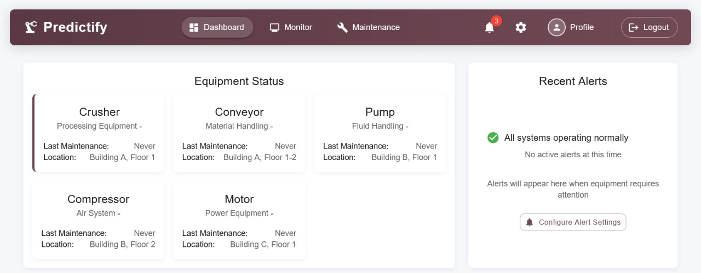
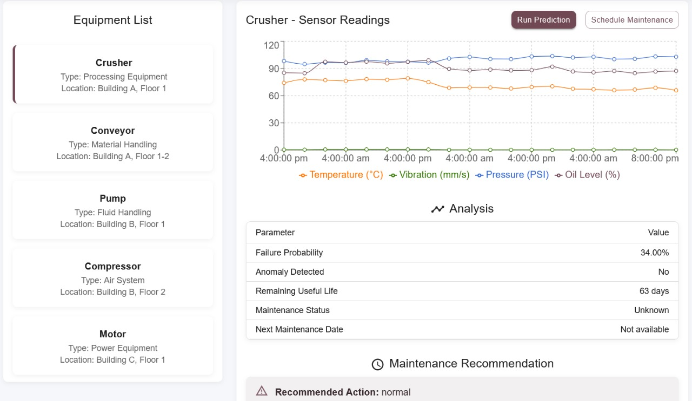
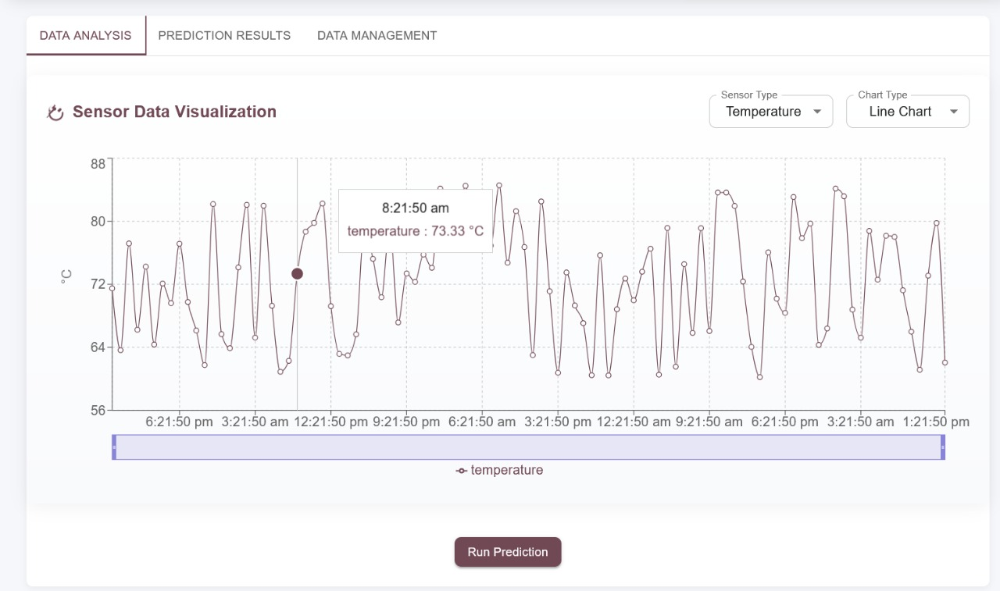
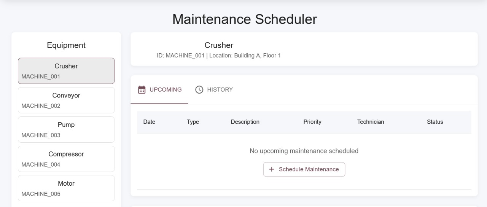
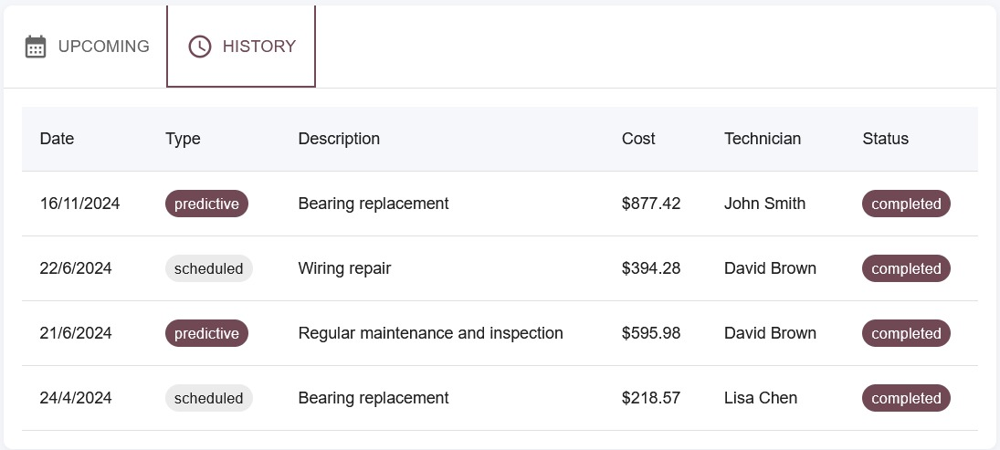
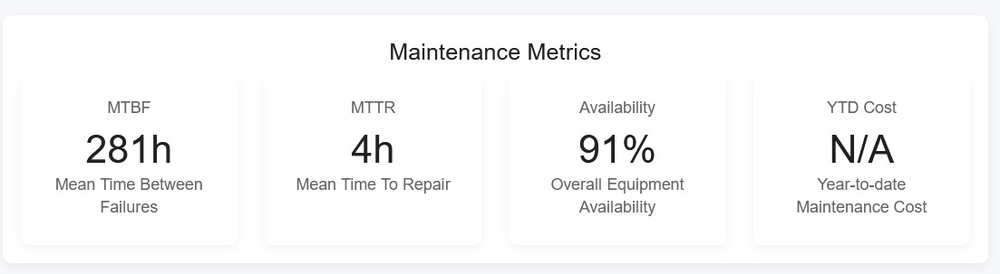

# Predictive Maintenance for Smart Manufacturing

A comprehensive predictive maintenance application for industrial equipment that uses machine learning to predict failures and optimize maintenance schedules.

## Screenshots

### Home Page


### Real-Time Monitoring


### Sensor Data Visualization


### Maintenance Scheduler


### Maintenance History


### Maintenance Metrics


### Data Management


## Features

- Real-time equipment monitoring dashboard
- Sensor data visualization with customizable charts
- ML-based predictive maintenance with remaining useful life estimation
- Maintenance scheduling and tracking
- Data connector management for various data sources (CSV, API, Modbus, OPC UA)
- Analytics dashboard with comparative metrics and ROI calculations
- Settings management for alerts, notifications, and ML model configuration

## Architecture

The application consists of two main components:

1. **Frontend**: React application with Material UI components
2. **Backend**: FastAPI Python server with machine learning capabilities

## Getting Started with Docker

This project is fully containerized using Docker. The easiest way to get started is with `docker-compose`.

### Prerequisites

- Docker
- Docker Compose

### Running the Application

1.  **Clone the repository:**
    ```bash
    git clone <repository-url>
    cd <repository-name>
    ```

2.  **Set up environment variables for the backend:**
    Navigate to the `backend` directory and copy the example environment file:
    ```bash
    cd backend
    cp .env.example .env
    ```
    Open the `.env` file and set the `SECRET_KEY`. You can generate a new key with `openssl rand -hex 32`.

3.  **Build and run the application with `docker-compose`:**
    From the root directory of the project, run:
    ```bash
    docker-compose up --build
    ```
    This will build the Docker images for both the frontend and backend and start the services.

4.  **Initialize the database:**
    In a separate terminal, while the application is running, execute the following command to create the database tables and populate them with sample data:
    ```bash
    docker-compose exec backend python init_db.py
    ```

5.  **Access the application:**
    *   **Frontend:** [http://localhost:3000](http://localhost:3000)
    *   **Backend API Docs:** [http://localhost:8000/docs](http://localhost:8000/docs)

## Training the Models

The application comes with pre-trained models. If you want to retrain the models with new data, you can use the `train_models.py` script.

1.  **Place your training data in the `datasets` directory.** See the existing files for examples of the required format.

2.  **Run the training script:**
    ```bash
    docker-compose exec backend python train_models.py
    ```
    This will generate new model files in the `models/` directory.

## Production Deployment

The provided Dockerfiles are designed for production. You can use them to build images and deploy them to any container hosting platform (e.g., AWS ECS, Google Cloud Run, DigitalOcean App Platform).

### Environment Variables

Make sure to set the following environment variables in your production environment:

-   `SECRET_KEY`: A strong, randomly generated secret key.
-   `DATABASE_URL`: The connection string for your production database (e.g., PostgreSQL or MySQL).
-   `REACT_APP_API_URL`: The URL of your deployed backend API (for the frontend).

### Building for Production

To build the production-ready Docker images, you can run:
```bash
docker-compose build
```
You can then push these images to a container registry and use them in your deployment.

## License

This project is licensed under the MIT License - see the LICENSE file for details.
