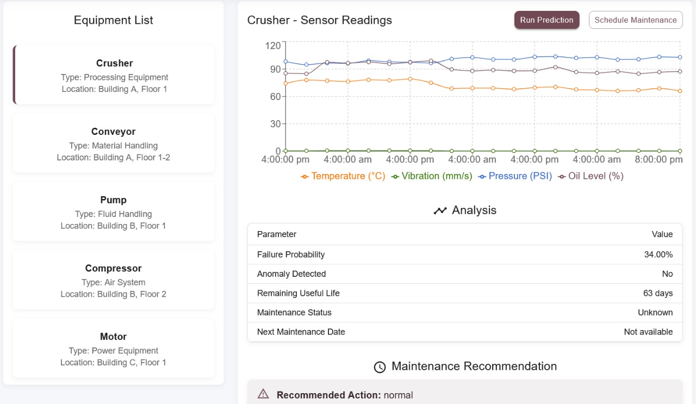

# Predictive Maintenance for Smart Manufacturing

A comprehensive predictive maintenance application for industrial equipment that uses machine learning to predict failures and optimize maintenance schedules.

## Screenshots

### Home Page


### Real-Time Monitoring


### Sensor Data Visualization


### Maintenance Scheduler


### Maintenance History


### Maintenance Metrics


### Data Management


## Features

- Real-time equipment monitoring dashboard
- Sensor data visualization with customizable charts
- ML-based predictive maintenance with remaining useful life estimation
- Maintenance scheduling and tracking
- Data connector management for various data sources (CSV, API, Modbus, OPC UA)
- Analytics dashboard with comparative metrics and ROI calculations
- Settings management for alerts, notifications, and ML model configuration

## Architecture

The application consists of two main components:

1. **Frontend**: React application with Material UI components
2. **Backend**: FastAPI Python server with machine learning capabilities

## Getting Started

### Prerequisites

- Node.js (v14+)
- Python (v3.8+)
- pip (Python package manager)

### Setting up the Backend

1. Navigate to the backend directory:
```bash
cd backend
```

2. Create a virtual environment (optional but recommended):
```bash
python -m venv venv
```

3. Activate the virtual environment:
```bash
# On Windows:
venv\Scripts\activate
# On macOS/Linux:
source venv/bin/activate
```

4. Install the required dependencies:
```bash
pip install -r requirements.txt
```

5. Generate sample training data:
```bash
python sample_data.py
```

6. Start the backend server:
```bash
uvicorn app.main:app --reload --port 8000
```

The API will be available at http://localhost:8000. You can access the interactive API documentation at http://localhost:8000/docs.

### Setting up the Frontend

1. In a new terminal, navigate to the project root

2. Install the required dependencies:
```bash
npm install
```

3. Start the development server:
```bash
npm start
```

The frontend application will be available at http://localhost:3000.

## Training a Model with Real Data

### Option 1: Using the UI

1. Start both the backend and frontend servers
2. Navigate to the "Data Management" tab in the application
3. Use the "Upload Historical Data" component to upload your CSV or JSON file
4. Navigate to the "Settings" view
5. Find the "Model Training" section and click "Train Model"

### Option 2: Using Sample Data

1. Start the backend server
2. The sample data script has already generated training data in `backend/data/`
3. Run the model training endpoint directly:
```bash
curl -X POST http://localhost:8000/api/model/train
```

### Data Format Requirements

Your CSV or JSON training data should include the following columns:
- `timestamp`: Date and time of the reading
- `equipment_id`: Unique identifier for the equipment
- `temperature`: Temperature reading
- `vibration`: Vibration reading
- `pressure`: Pressure reading
- `oil_level`: Oil level reading
- `is_failure`: Binary indicator (0/1) of whether a failure occurred

Example:
```
timestamp,equipment_id,temperature,vibration,pressure,oil_level,is_failure
2023-01-01T12:00:00,EQ001,72.5,3.2,102.1,95.0,0
2023-01-01T13:00:00,EQ001,74.1,3.4,103.2,94.5,0
2023-01-01T14:00:00,EQ001,78.3,4.1,105.5,92.1,0
...
2023-01-05T09:00:00,EQ001,92.6,6.8,115.5,65.2,1
```

## Using the Application

1. **Dashboard**: Monitor equipment status and key metrics
2. **Equipment Details**: View detailed information and sensor readings for specific equipment
3. **Prediction**: Run predictions on equipment to estimate failure probability and remaining useful life
4. **Data Management**: Upload historical data and manage data connectors
5. **Settings**: Configure alerts, notifications, and model parameters

## Production Deployment

For production deployment:

1. Build the React frontend:
```bash
npm run build
```

2. Deploy the static files to your web server

3. Configure environment variables for the backend:
```
DATABASE_URL=your_database_connection_string
SECRET_KEY=your_secret_key
```

4. Deploy the backend to a production server with proper security settings

## Hosting Instructions

### Frontend (React) - Vercel

1. Create a Git repository:
```bash
git init
git add .
git commit -m "Initial commit"
```

2. Create a GitHub repository at github.com/new

3. Push your code:
```bash
git remote add origin https://github.com/yourusername/predictive-maintenance.git
git push -u origin main
```

4. Deploy to Vercel:
   - Go to [vercel.com](https://vercel.com) and sign up with GitHub
   - Click "Import Project" → "Import Git Repository"
   - Select your repository
   - Configure build settings:
     - Framework preset: Create React App
     - Build command: `npm run build`
     - Output directory: `build`
   - Click "Deploy"

### Backend (FastAPI) - Render

1. Create a `requirements.txt` file in your backend directory:
```
fastapi==0.103.1
uvicorn==0.23.2
pydantic==2.3.0
numpy==1.25.2
pandas==2.1.0
scikit-learn==1.3.0
python-multipart==0.0.6
python-jose==3.3.0
passlib==1.7.4
bcrypt==4.0.1
```

2. Add a `Procfile` in your backend directory:
```
web: uvicorn app.main:app --host 0.0.0.0 --port $PORT
```

3. Go to [render.com](https://render.com) and sign up

4. Create a new Web Service:
   - Connect your GitHub repo
   - Set name (e.g., "predictive-maintenance-api")
   - Set build command: `pip install -r requirements.txt`
   - Set start command: `uvicorn app.main:app --host 0.0.0.0 --port $PORT`
   - Select free plan
   - Click "Create Web Service"

5. Update the frontend API URL to point to your Render backend:
```javascript
// src/services/api.js
const API_BASE_URL = process.env.REACT_APP_API_URL || 'https://your-render-app-name.onrender.com/api';
```

6. Set environment variables on Vercel:
   - Go to your Vercel project settings
   - Add environment variable: `REACT_APP_API_URL` = your Render backend URL

## License

This project is licensed under the MIT License - see the LICENSE file for details.
